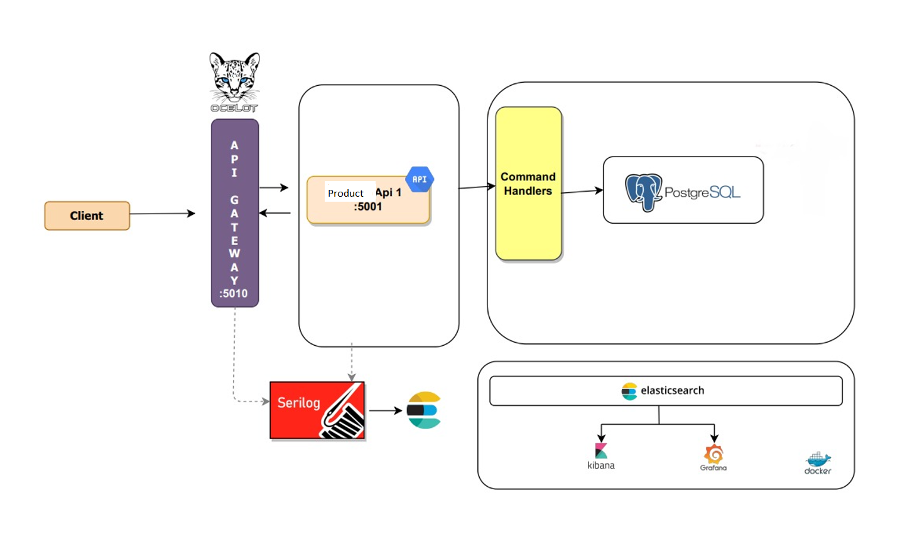

## Description

NextTech.sln is using microservices architecture written in .NET 5.0 SDK. 
This is a simple CQRS application.The solution follows the Domain-Driven Design (DDD) principles.
The following design patterns are used:

* Command Query Responsibility Separation (CQRS).
* Mediator

## Technologies & Tools

* ASP.Net 5.0
* ASP.NET Core Web API
* Entity Framework Core 5
* Ocelot API Gateway
* PostgreSQL
* Docker - Docker Compose
* Serilog
* Elasticsearch
* Kibana
* Grafana
* MediatR
* Xunit, FluentAssertions


| Concept | Description |
| --- | --- |
| [DDD](https://en.wikipedia.org/wiki/Domain-driven_design) | Domain-driven design (DDD) is the concept that the structure and language of software code (class names, class methods, class variables) should match the business domain. |
| [SOLID](https://en.wikipedia.org/wiki/SOLID) | The SOLID principles are all over the the solution. The knowledge of SOLID is not a prerequisite but it is highly recommended. |
| [Microservice](https://en.wikipedia.org/wiki/Microservices) | Microservice architecture – a variant of the service-oriented architecture (SOA) structural style – arranges an application as a collection of loosely coupled services. In a microservices architecture, services are fine-grained and the protocols are lightweight. |
| [Gateway](https://en.wikipedia.org/wiki/API_management) | A server that acts as an API front-end, receives API requests, enforces throttling and security policies, passes requests to the back-end service and then passes the response back to the requester.A gateway often includes a transformation engine to orchestrate and modify the requests and responses on the fly. A gateway can also provide functionality such as collecting analytics data and providing caching. The gateway can provide functionality to support authentication, authorization, security, audit and regulatory compliance. |
| [Load balancing](https://en.wikipedia.org/wiki/Load_balancing_(computing)) | In computing, load balancing refers to the process of distributing a set of tasks over a set of resources (computing units), with the aim of making their overall processing more efficient. |
| Docker | It was implemented to help us make a faster and reliable deployment. |
| CQRS | **[CQRS](https://martinfowler.com/bliki/CQRS.html)** is an acronym for *Command Query Responsibility Segregation*. CQRS allows you to separate the load from reads and writes allowing you to scale each independently |


## Prerequities

You will need the following tools:

* [Visual Studio Code or 2019](https://www.visualstudio.com/downloads/) 
* [.Net 5.0 SDK](https://dotnet.microsoft.com/download/dotnet/5.0)
* [Docker](https://www.docker.com/)
* [Docker Compose](https://docs.docker.com/compose/)

## Setup Debug Mode
* If you use windows operation system run `run-dev-up.bat` or run the command:
``` 
docker-compose -f docker-compose-dev.yml up -d --force-recreate
``` 

* All infrastructure to up and running. (gateway-api, product-api, postgres, grafana,elasticsearch and kibana)

* Open `NextTech.sln` file with vs2019

* Go to the Solution Explorer, right-click on 'NextTech.sln' and select the option “Set StartUp Projects…“

* Choose the `NextTech.Gateway` and `NextTech.Products.Api` to startup projects.

* Run the application.

## Services

| Service        	| Url                   	| Description                          	|
|----------------	|-----------------------	|--------------------------------------	|
| Api Gateway    	| http://localhost:5000 	|                                      	|
| Product Api 1   	| http://localhost:5010 	|                                      	|
| Elastichsearch 	| http://localhost:9201 	|                                      	|
| Kibana         	| http://localhost:5602 	|                                      	|
| Grafana        	| http://localhost:3001 	| uid:'admin', pwd:'admin'             	|
| PostgreSQL     	| http://localhost:5432 	|                                      	|
| Pgadmin        	| http://localhost:5050 	| email:'admin@admin.com', pwd:'admin' 	|


## Topology



Postman import file : docs/NextTechCollection.postman_collection.json